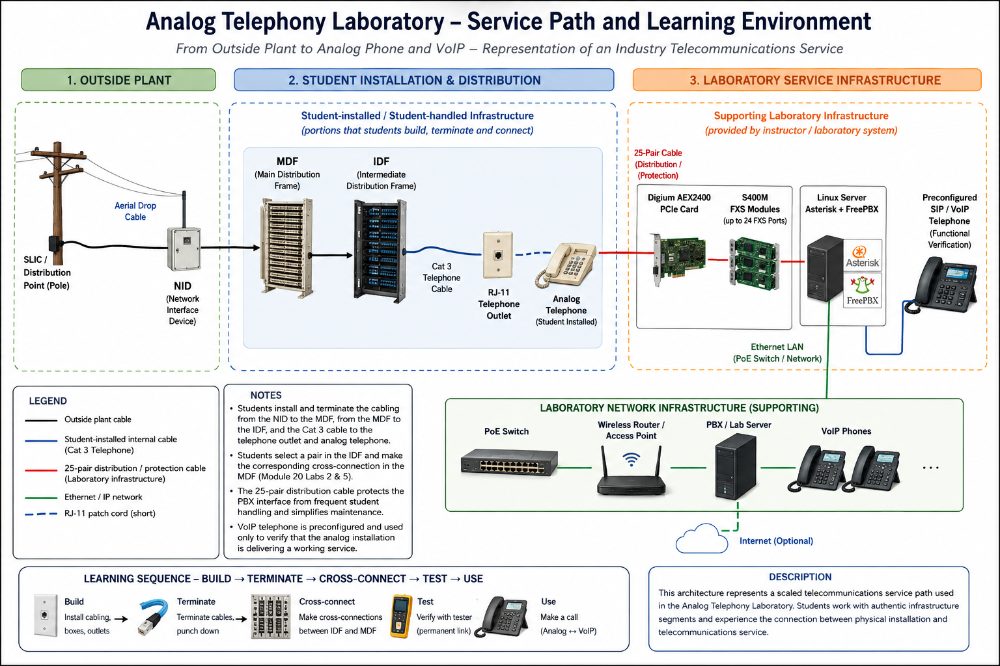
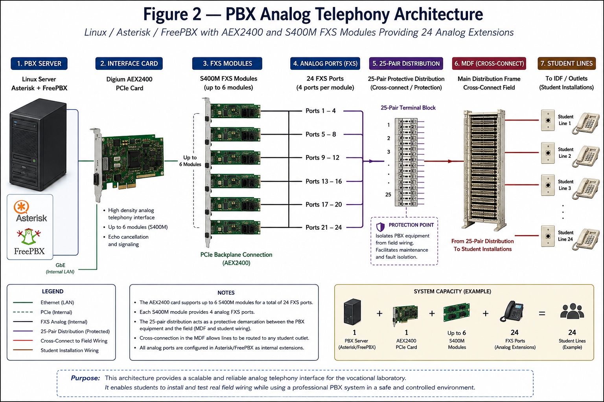

# Architecture

This directory contains technical and educational architecture diagrams for the Analog Telephony Laboratory case study.

The diagrams document both the representation of the telecommunications service path used for student learning activities and the supporting laboratory infrastructure used to provide analog telephone service in a controlled vocational education environment.

---

## Figure 1 — Analog Telephony Laboratory: Service Path and Learning Environment

**Figure 1.** Analog Telephony Laboratory service path and learning environment, illustrating the relationship between outside-plant infrastructure, student-installed telecommunications infrastructure, and the supporting laboratory system.

The diagram represents the progression from outside-plant infrastructure through the NID, MDF, IDF, customer-premises cabling, and analog telephone installation.

It also illustrates how the laboratory PBX and a preconfigured VoIP endpoint provide functional service verification after the student completes the analog installation.

The general learning sequence represented by the environment is:

**Build → Terminate → Cross-connect → Test → Use**

---

## Figure 2 — PBX Analog Telephony Architecture

**Figure 2.** Technical architecture of the laboratory PBX infrastructure used to generate and distribute analog telephone extensions to student installations.

The PBX environment is based on a Linux server running Asterisk and FreePBX with a Digium AEX2400 PCI Express telephony interface.

The AEX2400 supports S400M quad-port FXS modules, providing up to 24 analog station interfaces. These interfaces supply the analog telephone service used throughout the laboratory without requiring connection to the Public Switched Telephone Network (PSTN).

A 25-pair distribution connection provides a protective and maintainable interface between the PBX hardware and the telecommunications infrastructure routinely handled during student activities.

This architecture allows individual analog extensions to be routed through the MDF and subsequently to student installations while protecting the primary PBX cabling from repeated handling and modification.

---

## Architecture Design Considerations

The laboratory architecture was developed around several practical considerations:

- representation of relevant telecommunications service-path components;
- support for multiple simultaneous student installations;
- separation between student-handled infrastructure and core PBX equipment;
- low-cost repair and replacement of frequently manipulated cabling;
- reuse of the same PBX infrastructure across multiple laboratory activities;
- functional verification of completed installations;
- integration with subsequent VoIP learning activities;
- operation without recurring PSTN service requirements.

These design decisions support the broader objective of transforming authentic telecommunications work processes into accessible and maintainable hands-on learning environments for vocational education.

---

## Planned Documentation

Additional architecture documentation will include:

- physical implementation of the mobile training platform;
- identification of major system components;
- relationship between mobile and fixed laboratory installations;
- hardware inventory and implementation considerations.
