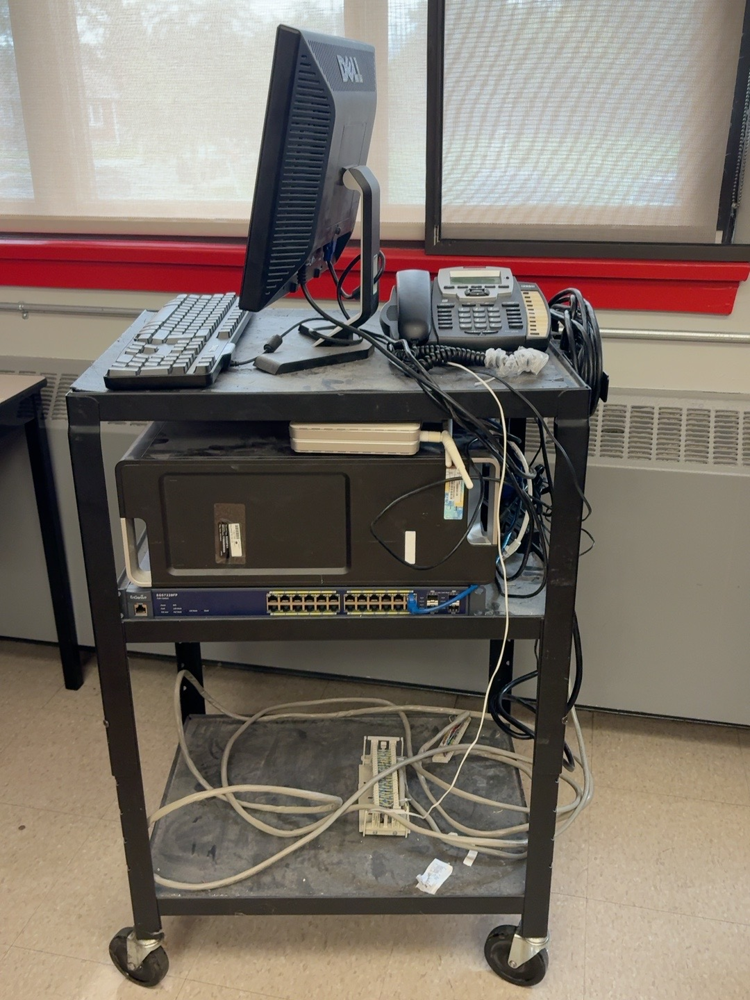
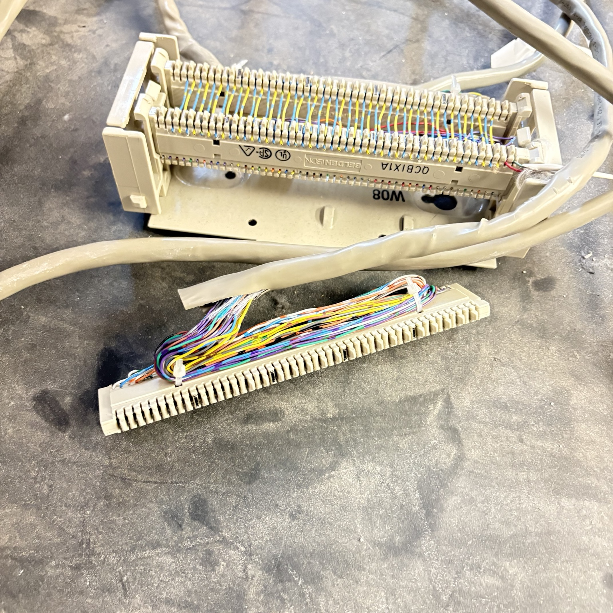

# Hardware

The Analog Telephony Laboratory was developed primarily by reusing equipment already available in the vocational school.

The specific models presented here represent the actual laboratory implementation and are not mandatory requirements for replication. Equivalent equipment may be used depending on available resources.

The objective is to demonstrate how existing, donated, repurposed, or low-cost equipment can be integrated into a functional telecommunications training environment.

## Laboratory Hardware

The implementation includes:

- Linux/PBX server
- Digium AEX2400 analog telephony interface
- Digium S400M FXS modules
- 25-pair telecommunications distribution interfaces
- Ethernet/PoE switch
- Wireless router
- Analog telephones
- SIP/VoIP telephones
- Telecommunications cabling and termination hardware

## Mobile Laboratory Setup

The laboratory equipment is assembled as a mobile training platform. This allows the supporting telecommunications infrastructure to be transported and positioned near the student work area when required.

The platform integrates the PBX server, analog telephony hardware, network infrastructure, telephone distribution, and functional endpoints.

## Analog Telephony Interface

The Digium AEX2400 provides the hardware interface between the PBX server and the analog telephone circuits.

FXS modules installed on the interface generate the analog telephone service used by the laboratory extensions.

## Telephone Distribution

25-pair telecommunications cable and distribution hardware connect the PBX analog interfaces to the laboratory distribution infrastructure.

This arrangement allows multiple analog telephone circuits to be distributed to student work areas using telecommunications installation practices.

## Network Infrastructure

The Ethernet/PoE switch provides network connectivity for the PBX environment and SIP/VoIP endpoints used for functional verification.

## Wireless Connectivity

The wireless router provides local wireless network access where required by the laboratory environment.

## Replication Considerations

The laboratory does not depend on the exact hardware models shown here.

When replicating the environment, equivalent equipment may be substituted provided that the required functions are available:

- PBX server platform
- FXS capability for analog telephone service
- Telecommunications distribution infrastructure
- Ethernet connectivity
- Analog telephone endpoints
- Optional SIP/VoIP endpoints for functional verification

This flexibility allows the laboratory concept to be adapted to equipment already available within a vocational education institution.

## Related Documentation

- [Architecture](../architecture/index.qmd)
- [Software](../software/index.qmd)
- [Learning Activities](../learning-activities/index.qmd)
- [Return to Analog Telephony Laboratory](../index.qmd)
