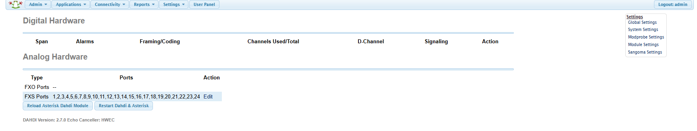
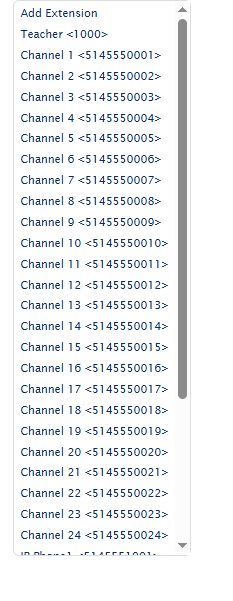
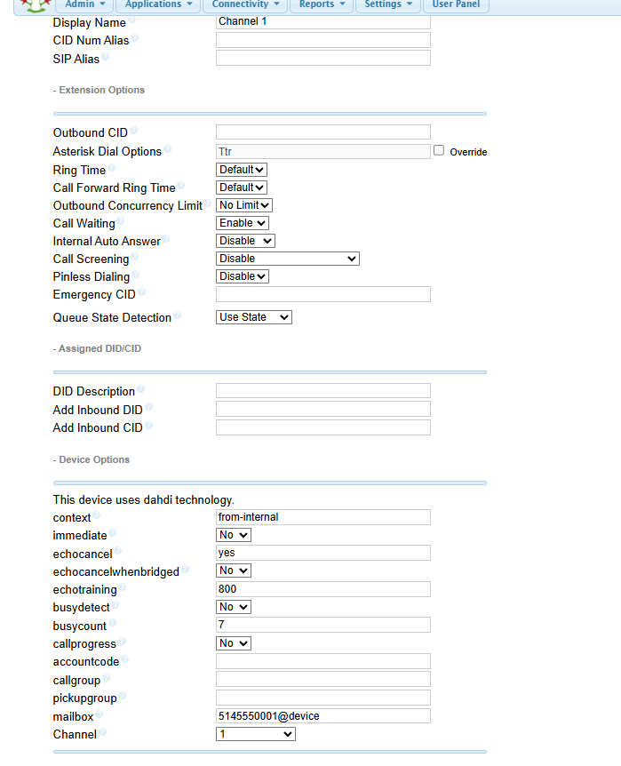

# FreePBX Configuration

This document describes the PBX configuration used to support the Analog Telephony Laboratory.

The objective of this configuration is to provide a self-contained telephone service that allows students to install, terminate, cross-connect, test, and use analog telephone circuits without requiring access to the public switched telephone network (PSTN).

The PBX server also supports SIP/VoIP endpoints. In the analog telephony activities, these endpoints are used primarily for functional verification of student-installed analog lines.

---

## System Architecture

The laboratory PBX is based on:

- Linux operating system
- Asterisk telephony engine
- FreePBX management interface
- DAHDI hardware interface
- Digium AEX2400 analog interface card
- Digium S400M FXS modules

The basic software and hardware relationship is:

> FreePBX  
> ↓  
> Asterisk  
> ↓  
> DAHDI  
> ↓  
> Digium AEX2400  
> ↓  
> S400M FXS Modules  
> ↓  
> 25-Pair Distribution Interface  
> ↓  
> Laboratory Telecommunications Infrastructure  
> ↓  
> Student-Installed Analog Telephone

---

## Analog Extensions

The analog telephone circuits are configured as PBX extensions through the FXS interfaces installed in the server.

Each FXS port provides the electrical telephone interface required by a standard analog telephone.

The analog service generated by the PBX is distributed through the laboratory telecommunications infrastructure, allowing the server to simulate the service that would normally originate from a telecommunications provider.

This approach creates a controlled and repeatable environment in which students can work with realistic analog telecommunications infrastructure without requiring an external telephone service.

---

## DAHDI Interface

DAHDI provides the interface between Asterisk and the Digium analog telephony hardware.

The implemented system provides 24 FXS ports, which are recognized by the PBX as DAHDI channels. These physical interfaces provide the analog telephone service distributed through the laboratory infrastructure.

*Figure 1. DAHDI hardware configuration showing the 24 FXS ports available in the implemented laboratory PBX.*

### Implemented Analog Extensions

The physical FXS channels are associated with individual analog PBX extensions.

*Figure 2. Analog extensions configured in the laboratory FreePBX system.*

The following example shows an individual analog extension configured using DAHDI technology and associated with physical Channel 1.

*Figure 3. Example of an analog PBX extension associated with DAHDI Channel 1.*

---

## Internal Call Environment

The laboratory operates as a private internal telephone system.

External PSTN connectivity is not required for the learning activities described in this case study.

Calls remain within the laboratory PBX environment, providing a controlled telecommunications network suitable for instructional use.

---

## Configuration Philosophy

The objective of the laboratory is not to teach FreePBX administration during the analog telephony module.

Instead, the PBX infrastructure is configured in advance by the instructor and functions as supporting laboratory infrastructure.

Students interact primarily with the physical telecommunications infrastructure they are learning to install and troubleshoot.

The PBX therefore serves as a service-generation and verification platform rather than the primary subject of instruction.

Detailed VoIP configuration and administration can be introduced separately in subsequent learning activities focused specifically on IP telephony.

---

## Replication

An identical FreePBX configuration is not required to reproduce the learning environment.

A comparable implementation requires a PBX platform capable of:

- supporting FXS analog interfaces;
- generating internal analog telephone service;
- assigning analog extensions;
- providing internal call routing; and
- optionally supporting SIP endpoints for functional verification.

Specific configuration examples from the implemented laboratory may be added to this repository as the system documentation is expanded.
