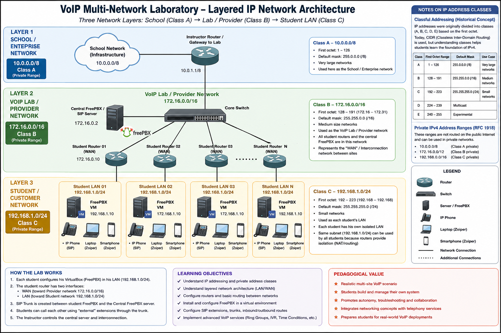
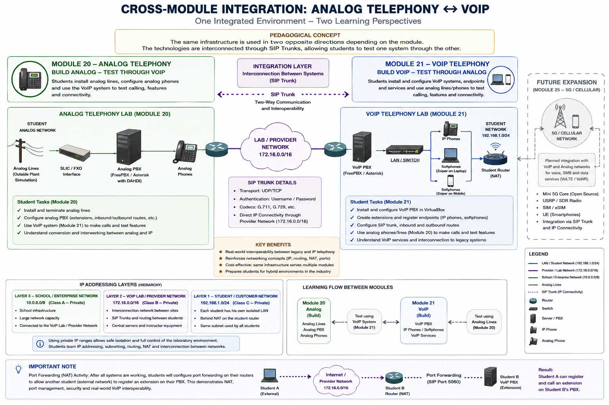

# Architecture

This section documents the network and system architecture of the VoIP Multi-Network Laboratory.

The laboratory is designed around a layered network model in which the school infrastructure, the central VoIP laboratory network, and the individual student networks remain logically separated.

This architecture allows students to work with routing, NAT, SIP trunks, PBX services, and endpoint configuration in a controlled multi-network environment.

---

## Figure 1 — Layered IP Network Architecture

*Figure 1. Layered IP network architecture of the VoIP laboratory, showing the separation between the school/enterprise network, the laboratory/provider network, and the individual student LANs.*

The laboratory uses three private IPv4 network layers:

- **School / Enterprise Network:** `10.0.0.0/8`
- **VoIP Laboratory / Provider Network:** `172.16.0.0/16`
- **Student / Customer Network:** `192.168.1.0/24`

The school network provides connectivity to the laboratory.

The instructor-managed router separates the school infrastructure from the VoIP laboratory network.

The central VoIP server and the WAN interfaces of the student routers are connected to the shared `172.16.0.0/16` network.

Each student router then creates an isolated `192.168.1.0/24` LAN containing the student's PBX, IP phone, laptop softphone, and mobile softphone.

Because each student LAN is isolated by a separate router, the same `192.168.1.0/24` subnet can be reused by multiple students without address conflicts.

This structure allows students to observe the relationship between:

**LAN → WAN → Routing → NAT → SIP Services**

---

## Historical IP Class Reference

The laboratory also provides an opportunity to explain the historical IPv4 class model:

- `10.0.0.0/8` — historically associated with **Class A**
- `172.16.0.0/16` — historically associated with **Class B**
- `192.168.1.0/24` — historically associated with **Class C**

Modern networks use CIDR addressing rather than classful addressing, but the layered laboratory architecture provides a useful context for explaining both concepts.

---
## Figure 2 — Cross-Module Analog–VoIP Integration

*Figure 2. Cross-module integration between the Analog Telephony and VoIP laboratories. The same infrastructure supports two complementary learning perspectives, with SIP trunking providing interoperability between the systems.*

The instructor-managed mobile cart provides the shared provider/interconnection infrastructure used by all student laboratories.

The central environment includes:

- Linux / FreePBX / Asterisk server;
- Ethernet switching;
- routing between the school network and the laboratory network;
- SIP endpoint for testing and demonstrations;
- and connectivity to student router WAN interfaces.

The central PBX provides extensions and interconnection services that allow students to place calls beyond their own private LAN.

---

## Figure 3 — Student VoIP Network

Each student receives an independent equipment set consisting of:

- laptop computer;
- router;
- physical SIP/IP telephone;
- VirtualBox PBX environment;
- laptop softphone;
- and mobile softphone.

The router creates the boundary between the shared provider network and the student's private LAN.

Students therefore configure and operate a complete routed VoIP environment rather than sharing a single PBX.

---

## Advanced Connectivity — NAT and Port Forwarding

Once the individual student networks are operational, students perform an advanced connectivity activity involving NAT and port forwarding.

A student configures an extension on their PBX and allows another student on the external laboratory network to register a SIP endpoint to that extension.

Because the PBX is located behind NAT, the student must configure the router so that the required service can be reached from the external network.

This activity reinforces practical concepts including:

- LAN/WAN separation;
- NAT;
- port forwarding;
- service reachability;
- SIP connectivity;
- and troubleshooting.

---

## Cross-Module Integration

When the same student cohort completes both the Analog Telephony and VoIP modules, the two laboratory environments can be interconnected through a SIP trunk.

The educational roles of the technologies are intentionally reversed:

**Analog Telephony Module**

Students build analog infrastructure and use VoIP endpoints for functional verification.

**VoIP Module**

Students build VoIP infrastructure and use analog telephone lines and endpoints for functional verification.

This creates a bidirectional analog–VoIP learning environment and demonstrates interoperability between legacy and IP-based telecommunications systems.

The same integration model is intended to support future cellular telecommunications expansion.
