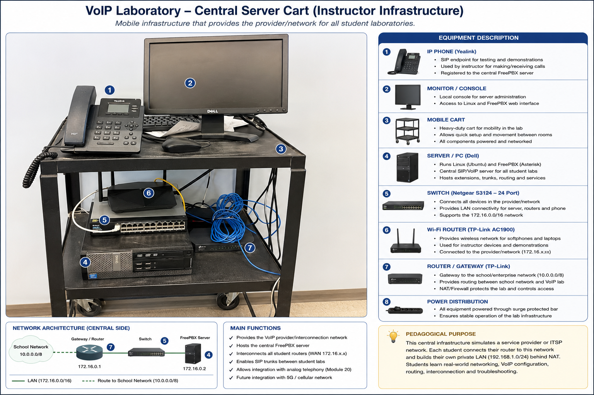
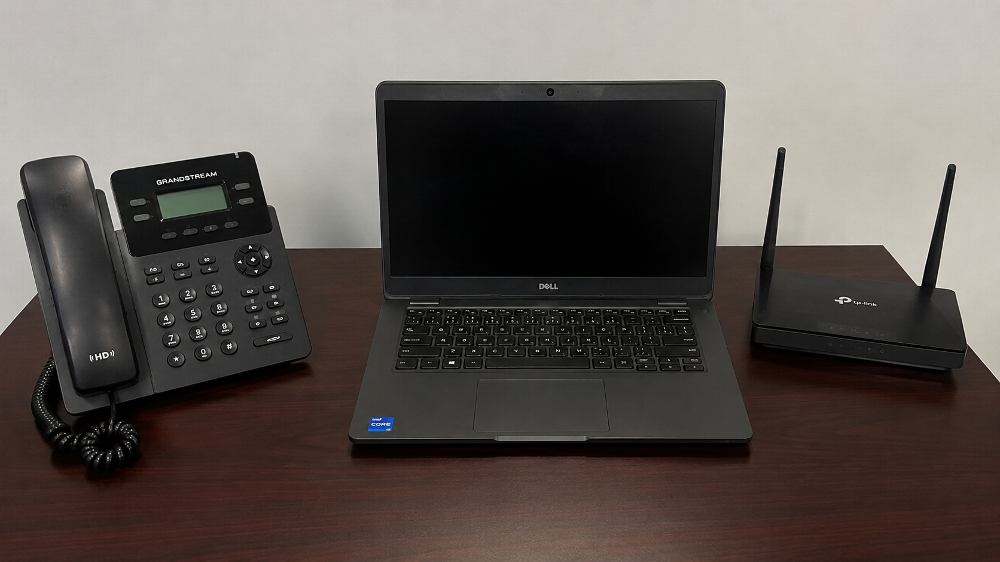

# Hardware

The VoIP Multi-Network Laboratory uses a combination of centralized instructor-managed infrastructure and individual student equipment sets.

The hardware architecture was designed to create a realistic multi-network VoIP environment while using readily available and reusable equipment.

## Central Server Cart

*Figure 1. Central instructor-managed VoIP laboratory infrastructure. The mobile platform integrates the FreePBX/Asterisk server, Ethernet switching, routing, wireless connectivity, SIP endpoint, and local administration console used to provide the shared laboratory/provider network for the student VoIP environments.*

## Central Laboratory Infrastructure

The central VoIP laboratory is installed on a mobile cart and provides the shared network and telephony infrastructure used by the student systems.

The platform includes:

### VoIP Server

A dedicated desktop computer runs the central Linux-based FreePBX/Asterisk system.

The server provides the shared PBX and SIP services used to interconnect the individual student VoIP networks.

### Core Ethernet Switch

A multiport Ethernet switch provides physical connectivity between the central infrastructure and the WAN interfaces of the student routers.

This allows multiple independent student networks to connect simultaneously to the laboratory/provider network.

### Laboratory Router

The central router provides the network boundary between the school infrastructure and the isolated VoIP laboratory environment.

The laboratory/provider network uses the private `172.16.0.0/16` address space.

### Instructor VoIP Phone

A physical SIP/IP telephone connected to the central system provides an endpoint for demonstrations, testing, and functional verification.

---

## Student Equipment Set

Each student receives an individual equipment set used to construct an independent VoIP network.

*Figure 2. Individual student equipment set used in the VoIP laboratory. Each student receives a laptop computer, dedicated router, and physical SIP/IP telephone to build and operate an independent VoIP network.*

The laptop also hosts the student's virtualized FreePBX environment and Zoiper softphone, while a mobile device can be added as an additional SIP endpoint.

The set includes:

### Laptop Computer

The laptop provides the student's primary configuration and testing platform.

It is used to run VirtualBox, access network equipment, configure the PBX, and operate a software-based VoIP endpoint.

### Student Router

Each student router separates the student's private LAN from the shared laboratory/provider network.

The router therefore provides a practical environment for working with:

- WAN and LAN addressing;
- routing;
- DHCP;
- Network Address Translation (NAT);
- and port forwarding.

### Physical VoIP Phone

A SIP/IP desk telephone provides a physical VoIP endpoint that students configure and register to their PBX.

Using a physical telephone allows students to connect PBX configuration and network concepts with an operational telecommunications device.

### Mobile Device

A smartphone running a SIP softphone can be connected to the student's network as an additional endpoint.

Together with the physical IP phone and laptop softphone, this allows multiple endpoint types to be tested within the same student environment.

---

## Equipment Reuse

An important design consideration of the laboratory is the reuse of existing networking and computing equipment.

The laboratory does not depend on a specialized commercial VoIP training platform. Standard computers, Ethernet switches, routers, IP phones, virtualization software, and open-source PBX software are combined to reproduce the functional relationships required for the learning activities.

This supports the broader objective of developing accessible industry-based laboratory environments for vocational education.
