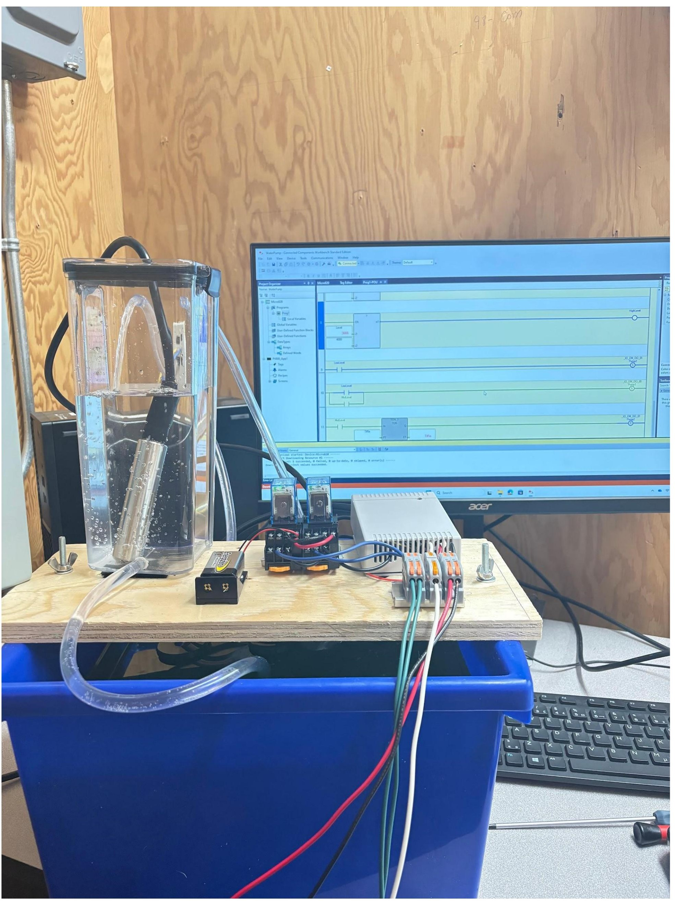

# Architecture

The laboratory is organized as a complete measurement-and-control chain rather than as isolated PLC exercises.

{fig-alt="Implemented water-level control laboratory training system" width="85%"}

## Functional Architecture

**Physical Process → Measurement → Signal Adaptation → PLC Processing → Output Interface → Actuation → Physical Process**

In the implemented system this becomes:

**Reservoir Level → 4–20 mA Level Sensor → Signal Conditioning → Voltage Analog Input → PLC Logic → Relay → DC Pump → Reservoir**

## Measurement Layer

An industrial level sensor provides a continuous **4–20 mA** signal proportional to water level. This gives students exposure to a standard industrial instrumentation interface rather than limiting the activity to a potentiometer or simulated value.

## Signal-Conditioning Layer

The available PLC uses voltage-based analog inputs, creating a deliberate compatibility problem between the industrial sensor and controller.

The signal-conditioning stage performs two functions:

1. converts the current-loop information into a voltage compatible with the PLC;
2. expands the useful measurement span from the approximately **1–1.9 V** produced by the small reservoir geometry to approximately **1–10 V**.

This demonstrates that the physical process, sensing method, electronics, and PLC analog-to-digital conversion cannot be treated independently.

## Control Layer

The PLC separates the application into input acquisition, decision logic, and output control. Conditioned analog values are interpreted through thresholds and timing logic before outputs are actuated.

## Stabilization Layer

Two complementary mechanisms are used:

- **Hardware filtering** attenuates high-frequency electrical noise before analog-to-digital conversion.
- **Software hysteresis and temporal control** prevent rapid state changes and excessive pump cycling near control thresholds.

## Actuation Layer

PLC outputs operate relays that switch the DC pumps. The pump action changes the physical reservoir level, completing the observable process-control loop.

## Functional Verification

The laboratory is verified through system behavior rather than only through PLC status indicators. A successful implementation must demonstrate stable level measurement, predictable threshold response, and pump operation without excessive cycling.

## Related Documentation

- [Hardware](../hardware/index.qmd)
- [Software & Control Strategy](../software/index.qmd)
- [Learning Activities](../learning-activities/index.qmd)
- [Return to Water-Level Case Study](../index.qmd)
