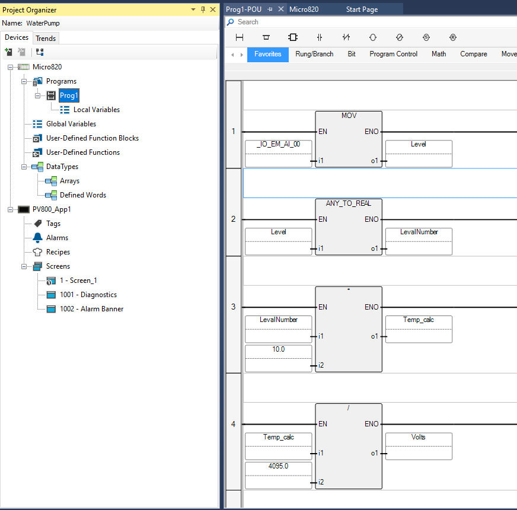

# Software & Control Strategy

The Module 22 PLC environment uses **Connected Components Workbench (CCW)** for controller configuration and ladder-logic development.

## Controller Configuration

Students first learn to create a CCW project, select the Micro820 controller, connect to physical or simulated controllers, and work with PLC I/O before progressing to the process-control project.

## Analog Acquisition

The water-level signal reaches the PLC as a conditioned analog voltage. The PLC reads the corresponding raw analog value, which must be interpreted and converted into a meaningful process quantity.

The instructional progression explicitly distinguishes:

**Sensor signal → Raw PLC value → Converted/Scaled value → Control decision**

This prevents analog control from being treated as simply another ON/OFF input.

## Decision Logic

{fig-alt="Water-level control PLC ladder logic in Connected Components Workbench" width="95%"}

The PLC program is structured around three functional stages:

1. **Input acquisition** — obtain the conditioned analog measurement.
2. **Decision logic** — compare the measurement with operating thresholds and system conditions.
3. **Output control** — operate the required pump through the relay interface.

## Hysteresis

Early testing showed that noise and small variations near a threshold could cause rapid output changes. Hysteresis separates the ON and OFF decision points so the controller does not repeatedly switch state when the measurement oscillates near one boundary.

This is a software solution to a real process-control problem rather than an artificial programming exercise.

## Temporal Control

Timers are used with threshold logic to make pump operation predictable and to prevent excessive actuator cycling. This directly builds on the earlier Module 22 timer activities.

## Hardware + Software Stabilization

Stable operation depends on two layers:

- analog hardware filtering before the PLC reads the signal;
- ladder-logic hysteresis and timing after the measurement is acquired.

The project therefore demonstrates why robust automation frequently requires coordination between electronics and software rather than a single-layer fix.

## HMI Extension

The broader Module 22 environment also introduces PanelView 800 HMI configuration in CCW, including tag import, Ethernet communication, pushbuttons, and visual indicators. These skills can be applied to process visualization and operator interaction, although the core water-level control function does not depend on an HMI.

## Related Documentation

- [Architecture](../architecture/index.qmd)
- [Hardware](../hardware/index.qmd)
- [Learning Activities](../learning-activities/index.qmd)
- [Return to Water-Level Case Study](../index.qmd)
